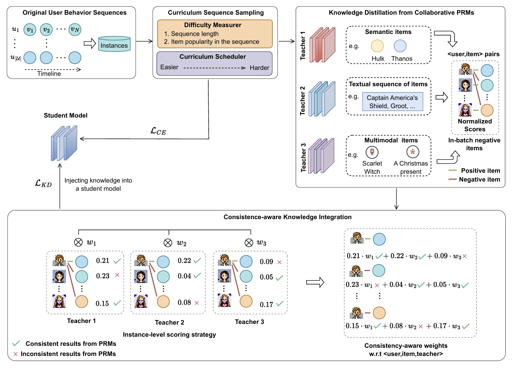

# CKD-MDSR

## Overview

we propose **CKD-MDSR**, which stands for **C**urriculum-scheduled **K**nowledge **D**istillation from multiple pre-trained teachers for **M**ulti-**D**omain **S**equential **R**ecommendation. Aiming to selectively integrate the informative knowledge distilled from various PRMs into a student model.





## Requirements

```
recbole>=1.1.1
python>=3.9.7
cudatoolkit>=11.3.1
pytorch>=1.11.0
numpy>=1.21.6
cupy>=11.6.0
tqdm>=4.64.1
```

## Contact

If you have any question, you can raise an issue or email Wenqi Sun (wenqisun@ruc.edu.cn). We will reply you soon.
